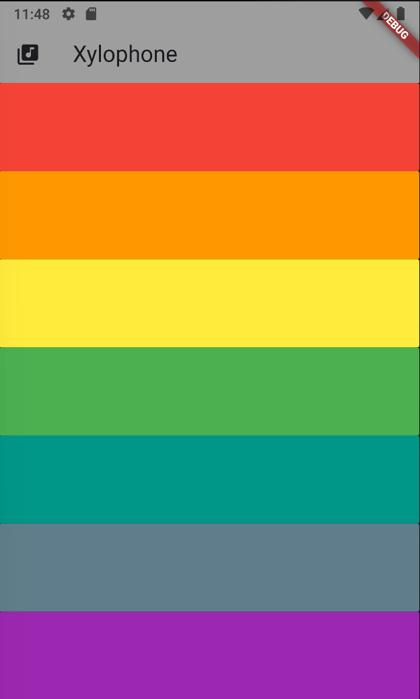

# flutter_xylophone_app

Xylophone App using audioPlayers package.

## Getting Started

Package: audioplayers 6.0.0

- [Package audoplayers](https://pub.dev/packages/audioplayers)

- [For more sounds](https://freesound.org/)

For help getting started with Flutter development, view the
[online documentation](https://docs.flutter.dev/), which offers tutorials,
samples, guidance on mobile development, and a full API reference.
